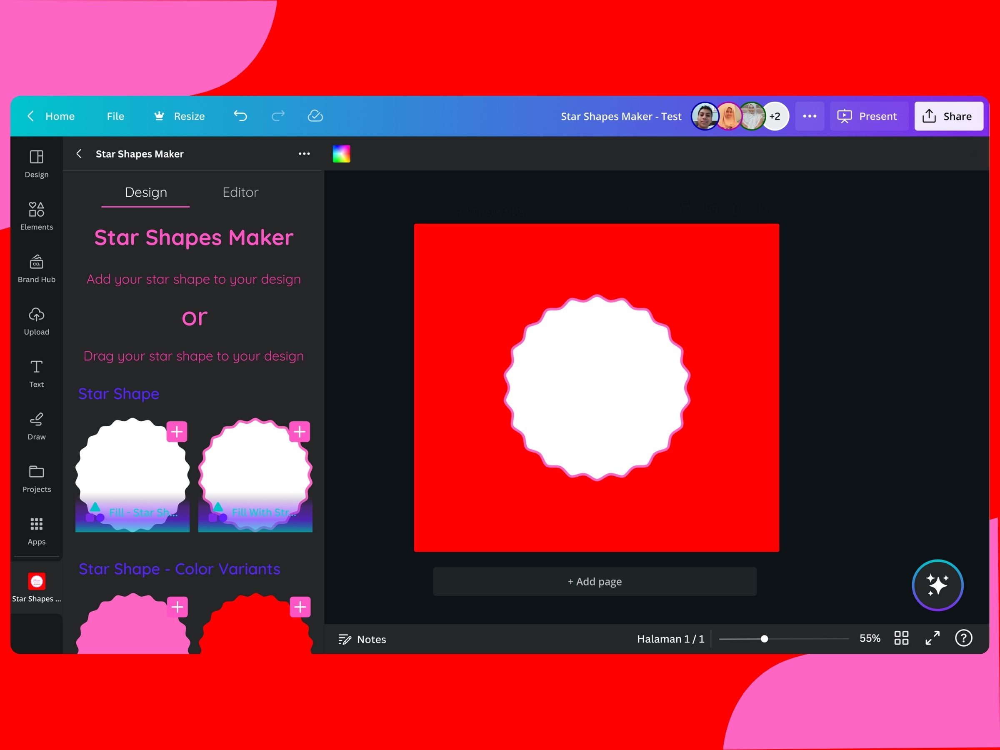
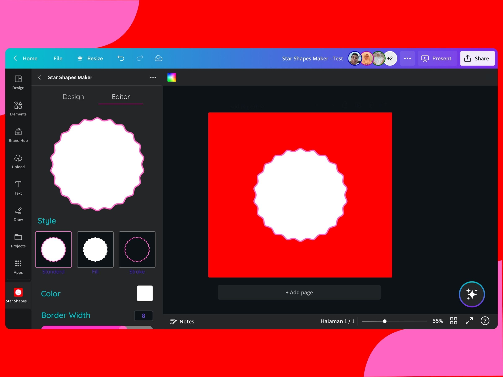
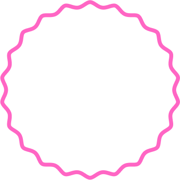
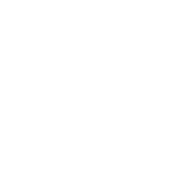
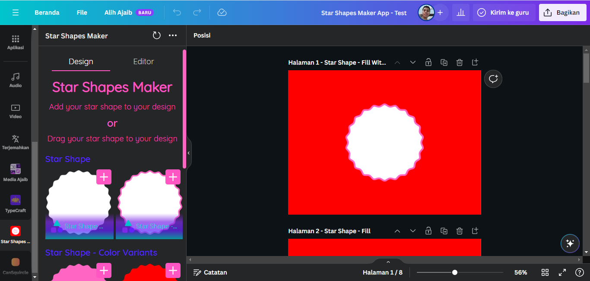

# Star Shapes Maker

Star Shapes Maker is a tool that can generate a star shapes in your canva design, Star Shapes Maker tool generates a star shapes that looks like a circle shape or a flower image.

Star Shapes Maker also has an editor when you can edit the star shape from the editor itself.

# Check out our website
[Star Shapes Maker](https://sites.google.com/view/starshapesmakerweb/home)

# How to Add Star Shapes Maker App to Your Canva Apps
1. Go to [Canva](https://www.canva.com)
2. In the left sidebar click on **Application** Tab
3. In **Application** Page Search for **Star Shapes Maker**
4. And Select **Star Shapes Maker**
5. And then click **Use in New Design**
6. And that's it.

# How to Add Stars Shapes To Your Design
1. Go to [Canva](https://www.canva.com) 
2. In the top navigation bar click on **Create a design**
3. And then Search **Logo** 
4. And then click **Logo** on the list
5. In the left sidebar scroll down until you see **Star Shapes Maker** Tab or if you see **Star Shapes Maker** Tab on bottom click on **Star Shapes Maker**
6. And choose different star shapes/circle shapes type, for example:
- i want to choose this

or this

- so here is the screenshot

1. And then click the image
2. And the image will be add to your design and uploaded to the upload tab
3. And that's it.

**Enjoy for your design**